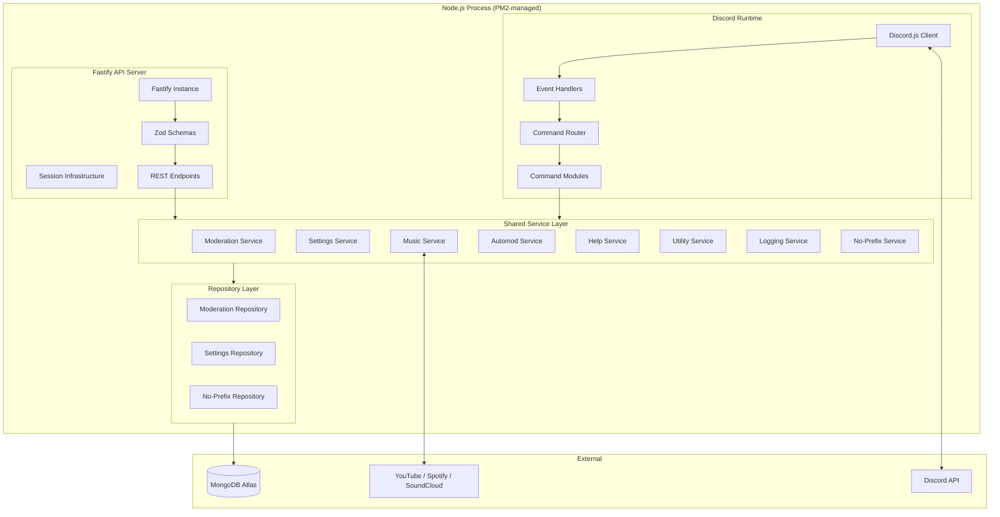
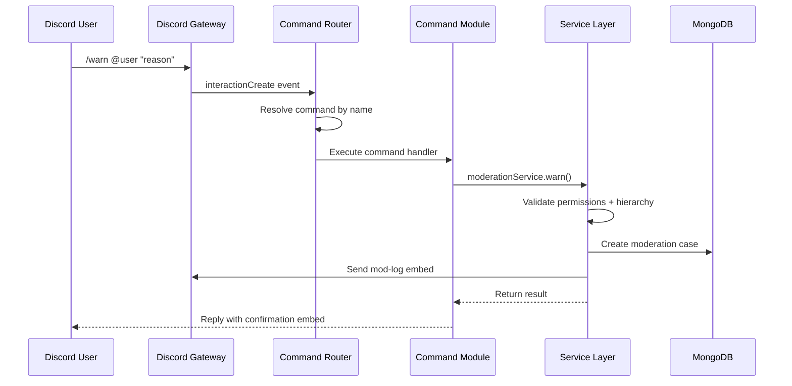
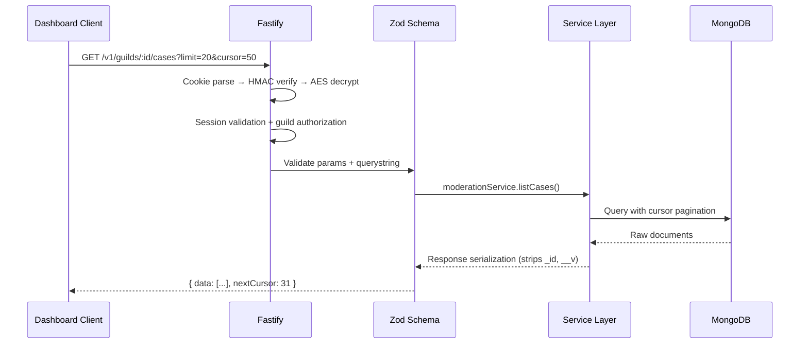
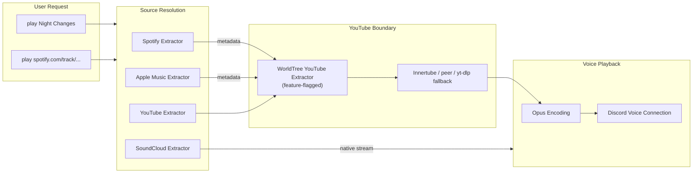
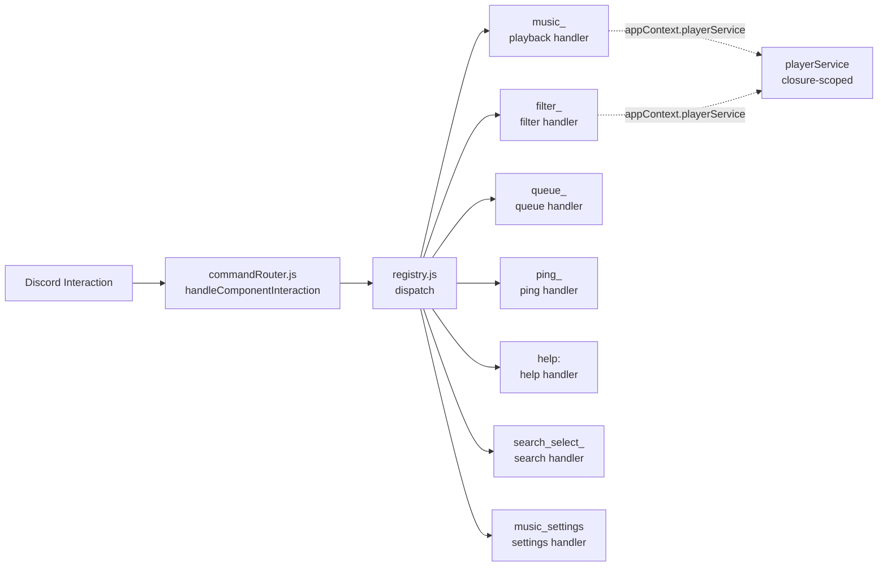
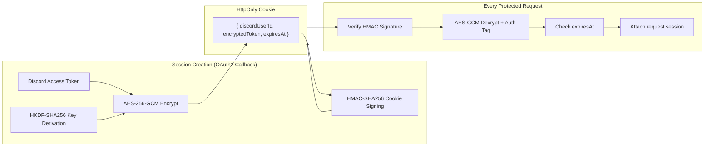

<div align="center">

# 🌳 World Tree - Yggdrasil

**A self-hosted Discord platform with modular services, encrypted API infrastructure, and low-overhead architecture.**

Built for fun. Designed like production infrastructure.

`Node.js` · `discord.js` · `Fastify` · `MongoDB` · `Zod` · `PM2` · `antiX Linux`

</div>

---

## Architecture Philosophy

World Tree is not a typical Discord bot. It is a **modular backend platform** that happens to communicate through Discord as its primary interface — with a Fastify REST API growing alongside it for future dashboard integration.

Every design decision optimizes for:

- **Self-hosted simplicity** — Runs on a low-power antiX Linux machine. No Docker, no Kubernetes, no cloud orchestration.
- **Single-process architecture** — The Discord client and API server coexist in one Node.js process, managed by PM2.
- **Strict service boundaries** — Commands are thin. Services own behavior. Repositories isolate storage. Nothing leaks across layers.
- **Operational clarity** — Graceful shutdown, structured logging, lifecycle hooks. The system should never die silently.

---

## System Architecture



---

## Codebase Structure

```text
world-tree/
│
├── src/
│   ├── index.js                          # Process entry — lifecycle hooks, shutdown orchestration
│   ├── bootstrap.js                      # Startup sequencer — DB → commands → events → login → API
│   ├── client.js                         # Discord.js client factory with gateway intents
│   ├── context/
│   │   └── appContext.js                 # Shared runtime container for bot dependencies
│   │
│   ├── api/                              # ── Fastify REST API ──────────────────────────────
│   │   ├── server.js                     # Server factory — Zod compiler, CORS, plugin registration
│   │   ├── plugins/
│   │   │   ├── cookiePlugin.js           # @fastify/cookie with HMAC-SHA256 signing
│   │   │   ├── sessionPlugin.js          # AES-256-GCM encrypted sessions, HKDF key derivation
│   │   │   ├── servicesPlugin.js         # Dependency injection — shared services into Fastify context
│   │   │   ├── discordOAuthPlugin.js     # Discord OAuth2 + PKCE helpers and safe Discord API calls
│   │   │   ├── rateLimitPlugin.js        # Global API limits and auth route sub-limits
│   │   │   └── errorHandler.js           # Centralized Zod validation + 5xx error formatting
│   │   └── routes/v1/
│   │       ├── auth/
│   │       │   └── auth.route.js         # GET login/callback/me + POST logout
│   │       ├── health/
│   │       │   └── health.route.js       # GET /v1/health — runtime, Discord, DB, memory
│   │       └── guilds/
│   │           ├── settings.route.js     # GET /v1/guilds/:guildId/settings
│   │           ├── cases.route.js        # GET /v1/guilds/:guildId/cases (cursor pagination)
│   │           └── stats.route.js        # GET /v1/guilds/:guildId/stats
│   │
│   ├── commands/                         # ── Discord Commands ──────────────────────────────
│   │   ├── moderation/
│   │   │   ├── warn.js                   # Issue a warning with case logging
│   │   │   ├── warnings.js              # List warnings for a user
│   │   │   ├── timeout.js               # Timeout a member with duration parsing
│   │   │   ├── untimeout.js             # Remove a timeout from a member
│   │   │   ├── kick.js                  # Kick a member with reason + case logging
│   │   │   ├── ban.js                   # Ban a user (supports non-members) with case logging
│   │   │   ├── purge.js                 # Bulk delete messages with channel-targeted case
│   │   │   └── case.js                  # Case lifecycle — view, list, resolve, delete, stats
│   │   │
│   │   ├── music/
│   │   │   ├── play.js                  # Play by name or URL — multi-platform resolution
│   │   │   ├── search.js               # Search and pick from top 5 results
│   │   │   ├── nowplaying.js            # Current track embed with interactive controls
│   │   │   ├── skip.js                  # Skip the current track
│   │   │   ├── stop.js                  # Stop playback, clear queue, disconnect
│   │   │   ├── pause.js                 # Pause the current track
│   │   │   ├── resume.js               # Toggle pause/resume
│   │   │   ├── volume.js               # Set volume (0–100)
│   │   │   ├── queue.js                # Display the current queue
│   │   │   ├── shuffle.js              # Shuffle the queue
│   │   │   ├── loop.js                 # Cycle loop modes: off → track → queue
│   │   │   ├── autoplay.js             # Toggle auto-queue of related songs
│   │   │   ├── filter.js               # Toggle audio effects (bassboost, nightcore, 8D, etc.)
│   │   │   ├── join.js                 # Join voice channel without playing
│   │   │   └── 247.js                  # Toggle 24/7 mode — stay in voice after queue ends
│   │   │
│   │   ├── setup/
│   │   │   ├── settings.js             # Guild settings viewer + nested subcommand router
│   │   │   ├── automod.js              # Automod configuration entry point
│   │   │   ├── modlog.js               # Mod-log channel shortcut
│   │   │   ├── setmodlog.js            # Deprecated compatibility wrapper for modlog setter
│   │   │   ├── noprefix.js             # No-prefix allowlist management (add/remove/list)
│   │   │   ├── trustedrole.js          # Trusted admin role management entry point
│   │   │   ├── activityrole.js         # Activity role shortcut command
│   │   │   └── setup-music.js          # Create #music-requests channel with auto-play behavior
│   │   │
│   │   └── utility/
│   │       ├── ping.js                  # Gateway + response latency with refresh button
│   │       ├── help.js                  # Interactive category-based help menu
│   │       ├── avatar.js               # Display user avatar at full resolution
│   │       ├── banner.js               # Display user banner at full resolution
│   │       ├── userinfo.js             # Account creation date, join date, roles, permissions
│   │       ├── serverinfo.js           # Guild metadata: members, channels, boosts, creation
│   │       ├── roleinfo.js             # Role metadata: color, position, permissions, members
│   │       ├── botinfo.js              # Runtime info: uptime, memory, Node version, guild count
│   │       ├── ownerinfo.js            # Server owner information summary
│   │       ├── uptime.js               # Bot uptime display
│   │       ├── membercount.js          # Quick member count
│   │       ├── stats.js                # Moderation case statistics summary
│   │       └── dashboard.js            # Dashboard status and URL display
│   │
│   ├── services/                         # ── Business Logic ────────────────────────────────
│   │   ├── moderationService.js          # Permission checks, hierarchy validation, case lifecycle
│   │   ├── settingsService.js            # Guild settings with in-memory TTL cache + normalization
│   │   ├── activityRoleService.js        # Presence/voice activity role assignment
│   │   ├── musicService.js               # discord-player init, extractor pipeline, event wiring
│   │   ├── musicChannelService.js         # Dedicated music-channel auto-play routing
│   │   ├── playerService.js              # Music player factory — createPlayerService() returns closure-scoped {setPlayer, getPlayer, getGuildQueue}
│   │   ├── helpService.js                # Category-based help menu builder
│   │   ├── utilityService.js             # User/server/role/bot info aggregation
│   │   ├── loggingService.js             # Mod-log channel delivery
│   │   ├── noPrefixService.js            # Global no-prefix privilege management + caching
│   │   └── automod/
│   │       ├── automodService.js         # Rule engine coordinator — evaluate → punish → log
│   │       ├── automodState.js           # In-memory rolling window state for spam detection
│   │       ├── punishmentExecutor.js     # delete / warn / timeout action dispatcher
│   │       └── rules/
│   │           ├── badWordsRule.js        # Case-insensitive word match
│   │           ├── mentionSpamRule.js     # Mention count threshold within time window
│   │           ├── repeatSpamRule.js      # Duplicate message detection within time window
│   │           ├── linkSpamRule.js        # URL detection with domain allowlist
│   │           ├── capsSpamRule.js        # Uppercase ratio + minimum length threshold
│   │           └── ruleResult.js          # Standardized rule match output
│   │
│   ├── database/mongo/                   # ── Data Layer ────────────────────────────────────
│   │   ├── connection.js                 # Mongoose connection with configurable timeout
│   │   ├── queryOptions.js               # Shared upsert/lean options
│   │   ├── migrationRunner.js            # Migration execution and tracking
│   │   ├── migrations/                   # Database migration scripts
│   │   │   ├── 001_init.js               # Initial schema setup
│   │   │   └── 002_ensure_activity_roles.js # Activity roles schema update
│   │   ├── models/
│   │   │   ├── GuildSettings.js          # Per-guild config: automod, moderation, trusted/activity roles
│   │   │   ├── Migration.js              # State tracking for applied migrations
│   │   │   ├── ModerationCase.js         # Case records: warn, timeout, kick, ban, purge
│   │   │   ├── Counter.js               # Atomic auto-increment for case IDs
│   │   │   └── NoPrefixPrivilege.js      # Global no-prefix user grants
│   │   └── repositories/
│   │       ├── settingsRepository.js     # CRUD + nested automod rule updates
│   │       ├── moderationRepository.js   # Case creation (retry on collision), cursor pagination
│   │       └── noPrefixRepository.js     # Privilege upsert and listing
│   │
│   ├── middleware/                        # ── Runtime Guards ───────────────────────────────
│   │   ├── commandRouter.js              # Slash command dispatch + component interaction dispatcher (consumes registry via dispatch)
│   │   ├── messageCommandRouter.js       # Prefix parsing + no-prefix shortcut resolution
│   │   ├── permissionGuard.js            # Permission checks: admin, moderation, no-prefix, hierarchy
│   │   └── errorHandler.js               # Interaction-level error recovery
│   │
│   ├── interactions/                     # ── Component Interaction Handlers + Registry ──────
│   │   ├── registry.js                   # Prefix-keyed interaction handler registry — register/dispatch/unregister
│   │   ├── registerAllHandlers.js        # Registers all 8 interaction handlers (idempotent)
│   │   ├── helpInteractionHandler.js     # Help select menu routing and response updates
│   │   ├── pingInteractionHandler.js     # Ping refresh button handling
│   │   ├── musicPlaybackInteractionHandler.js # Playback controls: pause/resume/skip/queue/volume
│   │   ├── musicFilterInteractionHandler.js   # Filter panel actions and filter toggles
│   │   ├── queueInteractionHandler.js    # Queue clear button handling
│   │   ├── searchInteractionHandler.js   # Search result select handling
│   │   ├── musicSettingsInteractionHandler.js # Playback settings panel handling
│   │   └── settingsButtonInteractionHandler.js # Guild settings dashboard navigation buttons
│   │
│   ├── loaders/
│   │   ├── commandLoader.js              # Recursive command discovery + contract validation
│   │   └── eventLoader.js                # Dynamic event handler registration
│   │
│   ├── config/
│   │   ├── env.js                        # Environment profiles: runtime, registration, core
│   │   ├── discord.js                    # Gateway intents + partial configuration
│   │   └── queueDefaults.js              # discord-player queue initialization options
│   │
│   ├── events/
│   │   ├── ready.js                      # Client ready — log confirmation + activity status
│   │   ├── interactionCreate.js          # Route interactions to commandRouter + component handlers
│   │   ├── messageCreate.js              # Route messages to messageCommandRouter + automod
│   │   ├── presenceUpdate.js             # Spotify/streaming/gaming activity role updates
│   │   └── voiceStateUpdate.js           # Voice activity role updates
│   │
│   └── utils/
│       ├── embeds.js                     # Visual embed system — moderation, music, utility, help
│       ├── components.js                 # Button rows — music player, queue, settings, filters
│       ├── lruCache.js                   # Zero-dependency LRU cache logic
│       ├── constants.js                  # Colors, limits, automod defaults, bot identity
│       ├── responses.js                  # Interaction/message reply abstraction
│       ├── logger.js                     # Pino-backed structured logger with redaction
│       ├── formatters.js                 # Duration, number, date formatting
│       ├── messageParser.js              # Prefix detection + argument extraction
│       ├── discordResolvers.js           # User/member/channel resolution from arguments
│       ├── moderationInputs.js           # Shared moderation command input extraction
│       └── fileDiscovery.js              # Recursive .js file finder for loaders
│
├── test/                                 # ── 48 Test Files ──────────────────────────────────
│   ├── activityRoleCommand.test.js       # Prefix command routing for activity roles
│   ├── activityRoleService.test.js       # Presence/voice role assignment behavior
│   ├── apiRoutes.test.js                 # Route serialization, pagination, field stripping
│   ├── apiServer.test.js                 # Fastify lifecycle, Zod validation, session integration
│   ├── appContext.test.js                # Shared runtime container creation and lookup
│   ├── authRoutes.test.js                # OAuth login/callback/me/logout route behavior
│   ├── automodService.test.js            # Rule matching, punishment, channel ignoring
│   ├── bootstrap.test.js                 # Startup sequencer integration
│   ├── commandHelpers.test.js            # Command helper utilities and resolvers
│   ├── commandLoader.test.js             # Command discovery, contract validation, duplicates
│   ├── commandRouter.test.js             # Slash command dispatch + unknown command handling
│   ├── components.test.js                # Button row construction, settings state
│   ├── dashboardContracts.test.js        # JSON Schema document validation
│   ├── discordConfigActivityRoles.test.js # Presence intent opt-in — verifies privileged intent is excluded by default
│   ├── discordOAuth.test.js              # PKCE, state, token exchange, identity fetch helpers
│   ├── embeds.test.js                    # Embed defaults, colors, field structure
│   ├── env.test.js                       # Environment config profiles, validation, API secrets
│   ├── helpCommand.test.js               # Help embed and category menu construction
│   ├── helpInteractionHandler.test.js    # Help category select menu interaction
│   ├── logger.test.js                    # Log formatting, levels, environment behavior
│   ├── lruCache.test.js                  # LRU Cache logic and eviction behavior
│   ├── messageCommandRouter.test.js      # Prefix routing, no-prefix, admin guards
│   ├── messageParser.test.js             # Prefix detection, quoted args, edge cases
│   ├── migrationRunner.test.js           # Database migration execution and error handling
│   ├── moderationRepository.test.js      # Atomic counters, case creation, warning listing
│   ├── moderationService.test.js         # Permission enforcement, hierarchy, case lifecycle
│   ├── musicChannelService.test.js       # Music-channel auto-play delegation
│   ├── musicCommands.test.js             # Play/247 voice channel validation
│   ├── musicComponentRouter.test.js      # Button interaction handling without active session
│   ├── musicFilterInteractionHandler.test.js # Audio filter toggle interactions
│   ├── musicInteractionHandlers.test.js  # General music interaction handler wiring
│   ├── musicPlaybackInteractionHandler.test.js # Playback control button interactions
│   ├── noPrefixRepository.test.js        # Privilege upsert operations
│   ├── noPrefixService.test.js           # Owner override, add/remove, cache behavior
│   ├── pauseResumeCommands.test.js       # Playback pause/resume commands
│   ├── permissionGuard.test.js           # Admin, moderation, no-prefix permission checks
│   ├── pingInteractionHandler.test.js    # Ping refresh button interaction
│   ├── playerService.test.js             # Music player factory closure behavior
│   ├── pm2Config.test.js                 # PM2 process config validation
│   ├── queryOptions.test.js              # Upsert option configuration
│   ├── registry.test.js                  # Interaction handler registry contract
│   ├── responses.test.js                 # Reply/followUp/edit interaction abstraction
│   ├── sessionPlugin.test.js             # Crypto roundtrip, tamper detection, expiry, cookie attrs
│   ├── settingsButtonInteractionHandler.test.js # Settings panel button interactions
│   ├── settingsRepository.test.js        # CRUD, mod-log, automod rule updates
│   ├── settingsService.test.js           # Settings normalization, cache invalidation
│   ├── settingsServiceActivityRoles.test.js # Activity role settings persistence
│   └── utilityService.test.js            # Ping, avatar, user/server/bot/role info
│
├── scripts/
│   ├── registerCommands.js               # Guild-scoped slash command deployment
│   └── migrate.js                        # Standalone migration CLI runner
│
├── dashboard/                            # ── Future Dashboard Contracts ────────────────────
│   ├── contracts/
│   │   ├── guild-settings.schema.json    # Guild settings response shape
│   │   ├── automod-settings.schema.json  # Automod configuration response shape
│   │   └── moderation-case.schema.json   # Moderation case response shape
│   ├── API.md                            # Planned endpoint documentation
│   ├── README.md                         # Dashboard planning notes
│   └── WIREFRAMES.md                     # UI wireframe notes
│
├── ecosystem.config.cjs                  # PM2 process config — fork mode, restart controls, log files
├── .env.example                          # Environment variable template
├── .gitignore                            # Git ignore rules (node_modules, .env, logs)
├── Tree.jpg                              # Bot avatar / project logo
├── docs/                                 # ── Documentation ─────────────────────────────────
│   ├── Checklist.txt                     # Development progress checklist
│   ├── Implementation_Plan.txt           # Original implementation planning document
│   ├── PRD.txt                           # Product requirements document
│   ├── System_Architecture.txt           # System architecture design notes
│   └── Technical_Specification.txt       # Technical specification reference
└── package.json                          # Node.js ≥ 20.0.0, ESM modules
```

---

## Request Lifecycle

### Discord Command Flow



### API Request Flow



---

## Music Streaming Pipeline

World Tree streams audio from Spotify, Apple Music, YouTube, and SoundCloud through a unified pipeline.



- **Spotify & Apple Music** resolve track metadata, then bridge through YouTube for the actual audio stream
- **YouTube** uses `discord-player-youtubei` by default. Setting `USE_LOCAL_YOUTUBE_EXTRACTOR=true` enables the staged WorldTree-owned extractor instead.
- **SoundCloud** streams natively without bridging
- **yt-dlp** is an optional final fallback only inside the local YouTube boundary; it is not a global stream interceptor
- **Rollback** is configuration-only: set `USE_LOCAL_YOUTUBE_EXTRACTOR=false` and restart

### Player Controls

Now Playing embeds include two rows of interactive buttons:

**Row 1:** ⏮️ Previous · ⏸️ Pause · ▶️ Resume · ⏭️ Skip · ⚙️ Settings
**Row 2:** 🔀 Shuffle · 📜 Queue · 🔊 Vol+ · 🔉 Vol- · ⏹️ Stop

The ⚙️ Settings button opens a private panel with loop mode selection, autoplay toggle, and audio filter controls.

Available filters: `bassboost`, `nightcore`, `vaporwave`, `8D`, `karaoke`, `tremolo`, `vibrato`.

---

## Interaction Handler Architecture

Component interactions (buttons, select menus) are routed through a **prefix-keyed registry** so new handlers can be added without modifying the dispatcher.



### Registry contract

```js
// src/interactions/registry.js
registerHandler({ prefix: 'music_', handle: handlePlaybackInteraction });
// ...

export function dispatch(interaction) {
  for (const { handle } of handlers.values()) {
    const result = await handle(interaction);
    if (result) return true;   // first handler to return truthy wins
  }
  return false;
}
```

- Handlers self-guard via `interaction.customId.startsWith(prefix)` — `dispatch` does NOT pre-filter.
- Handlers export `{prefix, handle}` shape; `registerAllHandlers()` registers all 7 at module load.
- The `commandRouter.js` dispatcher imports **zero** `*InteractionHandler.js` files directly.

### Adding a new handler

1. Create `src/interactions/<name>InteractionHandler.js` exporting `{prefix, handle}`.
2. Add one line to `src/interactions/registerAllHandlers.js`:

   ```js
   registerHandler({ prefix: '<unique_prefix>', handle: handle < Name > Interaction });
   ```

No edits to `commandRouter.js` are required.

### playerService factory

The music player is no longer a module-level global. Instead, `src/services/playerService.js` exports a factory whose closure owns the state:

```js
export function createPlayerService() {
  let player = null;
  return {
    setPlayer(nextPlayer) {
      player = nextPlayer;
      return player;
    },
    getPlayer() {
      return player;
    },
    getGuildQueue(guildId) {
      return player?.nodes?.get(guildId) ?? null;
    }
  };
}
```

`bootstrap.js` constructs one instance and threads it through `appContext.playerService`. Interaction handlers, music commands, and the music service all consume it via `getAppContext(source)?.playerService` — no direct imports of `services/playerService.js` from consumer code.

---

## Session & Security Infrastructure

The API uses a **zero-dependency session system** — no Redis, no database sessions, no JWTs.



| Property       | Value                                                  |
| -------------- | ------------------------------------------------------ |
| Encryption     | AES-256-GCM with 12-byte random IV                     |
| Key Derivation | HKDF-SHA256 from `SESSION_SECRET`                      |
| Cookie Signing | HMAC-SHA256 via `@fastify/cookie` (timing-safe)        |
| Cookie Flags   | `HttpOnly`, `SameSite=Lax`, `Secure` (prod), `Path=/`  |
| Token Storage  | Encrypted inside cookie — no server-side session state |

### OAuth2 + PKCE Flow

Discord is the only identity provider. The API implements the Authorization Code flow with PKCE and issues the existing encrypted session cookie after Discord identity is verified.

| Route                   | Behavior                                                                            |
| ----------------------- | ----------------------------------------------------------------------------------- |
| `GET /v1/auth/login`    | Generates state + PKCE verifier cookies and redirects to Discord                    |
| `GET /v1/auth/callback` | Validates state/verifier, exchanges code, fetches `/users/@me`, issues session      |
| `GET /v1/auth/me`       | Requires `sessionGuard`, fetches live Discord identity, returns safe profile fields |
| `POST /v1/auth/logout`  | Requires `sessionGuard`, clears the session cookie                                  |

Redirect URIs are built only from explicit config: `${API_ORIGIN}/v1/auth/callback`. Dashboard redirects always use `DASHBOARD_ORIGIN`; request headers are never trusted for redirect targets.

---

## Command Model

World Tree routes all input types into the same command architecture.

### Three Input Modes

| Mode          | Format                           | Example                        |
| ------------- | -------------------------------- | ------------------------------ |
| **Slash**     | Discord slash commands           | `/warn user:@user reason:Spam` |
| **Prefix**    | `tree` prefix (case-insensitive) | `tree warn @user "Spam"`       |
| **No-Prefix** | Allowlisted users only           | `warn @user "Spam"`            |

No-prefix access is **global and bot-managed** — not inherited from Discord server permissions. Only the bot owner can manage the allowlist via `tree noprefix add/remove/list`.

### Playback Commands

| Command      | Aliases                     | Description                             |
| ------------ | --------------------------- | --------------------------------------- |
| `play`       | `p`                         | Play a song by name or link             |
| `search`     | `find`                      | Search and pick from top 5 results      |
| `nowplaying` | `np`                        | Current track with interactive controls |
| `skip`       | `s`, `next`                 | Skip the current track                  |
| `stop`       | `dc`, `disconnect`, `leave` | Stop playback and clear queue           |
| `resume`     | `pause`, `togglepause`      | Toggle pause/resume                     |
| `volume`     | `vol`                       | Set volume (0–100)                      |
| `queue`      | `q`                         | View the current queue                  |
| `shuffle`    | `mix`                       | Shuffle the queue                       |
| `loop`       | `repeat`                    | Cycle: off → track → queue              |
| `autoplay`   | `ap`                        | Auto-queue related songs                |
| `filter`     | `fx`, `filters`             | Toggle audio effects                    |
| `join`       | `connect`, `summon`         | Join voice channel                      |
| `247`        | `stay`, `24/7`              | Toggle 24/7 mode                        |

### Moderation Commands

`warn` · `warnings` · `timeout` · `untimeout` · `kick` · `ban` · `purge`

Case lifecycle: `/case view` · `/case list` · `/case resolve` · `/case delete` · `/case stats`

Cases are soft-deleted. The moderation service enforces permission checks, role hierarchy, bot capability validation, reason requirements, and mod-log delivery on every action.

### Automod

Settings-driven, in-memory rolling windows. No Redis.

- Bad word filtering (case-insensitive)
- Mention spam (threshold within time window)
- Repeated message spam (duplicate detection)
- Link spam (with domain allowlist)
- Caps spam (ratio + minimum length)
- Punishments: `delete`, `warn`, `timeout`

### Activity Roles

Activity roles assign or remove configured roles when a member starts or stops a tracked activity.

| Type        | Trigger                            |
| ----------- | ---------------------------------- |
| `spotify`   | Listening to Spotify               |
| `streaming` | Streaming activity                 |
| `gaming`    | Playing a game                     |
| `voice`     | Joining or leaving a voice channel |

Slash command:

```bash
/activityrole set type:spotify role:@Spotify
/activityrole remove type:spotify
/activityrole list
```

Prefix and owner no-prefix shortcuts:

```bash
tree activityrole set spotify @Spotify
tree activityrole remove spotify
activityrole set spotify @Spotify
```

Operational requirements:

- The bot needs `Manage Roles`.
- The bot's highest role must be above the activity role.
- Presence-based types require the Developer Portal `Presence Intent`.
- Voice roles require `GuildVoiceStates`, which is enabled in the bot client config.
- Discord server owners can receive activity roles, but bot accounts are ignored.

---

## Deployment Model

World Tree uses a **Provider Operations SDK** that abstracts the process manager, allowing it to run natively on Linux servers.

```text
┌─────────────────────────────────────────┐
│          Linux (Oracle Cloud / antiX)    │
│                                         │
│  ┌───────────────────────────────────┐  │
│  │        Operations SDK (ops/)      │  │
│  │  ┌─────────────────────────────┐  │  │
│  │  │   systemd (or pm2 plugin)   │  │  │
│  │  │                             │  │  │
│  │  │  Discord Client  ◄──────►  Discord API  │
│  │  │  Fastify API     ◄──────►  :3000        │
│  │  │  Mongoose        ◄──────►  MongoDB Atlas│
│  │  └─────────────────────────────┘  │  │
│  └───────────────────────────────────┘  │
└─────────────────────────────────────────┘
```

- **Single process** — no cluster, no workers
- **Operations SDK** (`ops/lib/providers/systemd.sh`) manages restarts, limits, and logging gracefully
- **Graceful shutdown** orchestrated in `index.js`: Discord client → API server → MongoDB connection
- **`SIGINT`/`SIGTERM`** handlers ensure clean exit on stop/restart
- **`unhandledRejection`/`uncaughtException`** trigger controlled shutdown — never silently continue in corrupted state

---

## Logging

World Tree uses Pino through a thin local wrapper at `src/utils/logger.js`.

- Production logs are structured JSON with stable `level`, `time`, `scope`, `msg`, and optional `component` fields.
- Development logs use `pino-pretty` automatically for readable terminal output.
- Existing call sites keep the simple `logger.info/warn/error/debug(message, details)` shape.
- Auth-sensitive values are redacted, including OAuth codes, verifier/state values, access tokens, authorization headers, and client secrets.
- Child loggers are supported with `logger.child({ component: 'serviceName' })`.

---

## API Operations

The Fastify REST API automatically generates OpenAPI documentation using Zod schema inference. You can interactively test and view all endpoint schemas via the Swagger UI panel.

- **Access the API Panel**: With the server running, navigate to `http://localhost:3000/docs`.
- `GET /v1/health` returns `200` when Discord and MongoDB are healthy.
- `GET /v1/health` returns `503` with `status: degraded` when either dependency is unhealthy.
- `API_RATE_LIMIT_MAX`, `AUTH_RATE_LIMIT_MAX`, and `RATE_LIMIT_WINDOW` tune API request limits when `ENABLE_API=true`.
- `/v1/auth/*` uses a stricter request budget than the rest of the API.

---

## Environment Variables

```env
# ── Core ───────────────────────────────────
DISCORD_TOKEN=your_discord_bot_token
MONGO_URI=your_mongodb_atlas_connection_string
CLIENT_ID=your_discord_application_client_id
BOT_OWNER_ID=your_discord_user_id
NODE_ENV=development

# ── Command Registration ─────────────────────
# DEV_GUILD_ID: Required for development (instant guild-scoped registration)
# GUILD_ID: Backward-compatible alias for DEV_GUILD_ID
# In production (NODE_ENV=production), commands are registered globally — no guild ID needed
DEV_GUILD_ID=your_test_discord_server_id
GUILD_ID=your_test_discord_server_id

# ── Optional ─────────────────────────────────
MONGO_SERVER_SELECTION_TIMEOUT_MS=10000
TRUSTED_ADMIN_ROLE_IDS=optional_role_id,optional_second_role_id
DASHBOARD_URL=optional_runtime_url_display

# ── API (required when ENABLE_API=true) ────
ENABLE_API=true
API_PORT=3000
API_RATE_LIMIT_MAX=120
AUTH_RATE_LIMIT_MAX=20
RATE_LIMIT_WINDOW=1 minute
SESSION_SECRET=random_32_byte_hex_string
DISCORD_CLIENT_SECRET=your_oauth2_client_secret
DASHBOARD_ORIGIN=http://localhost:5173
API_ORIGIN=http://localhost:3000

# ── Music (optional) ──────────────────────
DP_SPOTIFY_CLIENT_ID=your_spotify_client_id
DP_SPOTIFY_CLIENT_SECRET=your_spotify_client_secret
```

---

## Command Registration

World Tree uses a **dual-mode command registration strategy** depending on `NODE_ENV`.

### Development Mode (default)

```bash
npm run register:commands
```

- Registers commands **guild-scoped** using `DEV_GUILD_ID`
- Updates are **instant** — no propagation delay
- Only visible in the configured development guild
- Perfect for rapid iteration during development

### Production Mode

```bash
NODE_ENV=production npm run register:commands
```

- Registers commands **globally** across all servers
- May take up to **1 hour** to propagate across Discord
- Visible to every server where the bot is invited
- Run this once per deploy when commands change

### Why Two Modes?

| Mode   | Scope         | Speed        | Use Case               |
| ------ | ------------- | ------------ | ---------------------- |
| Guild  | Single server | Instant      | Development, testing   |
| Global | All servers   | Up to 1 hour | Production deployments |

---

## Development

```bash
npm install                  # Install dependencies
npm test                     # Run full test suite (Node.js built-in test runner)
npm run register:commands    # Deploy slash commands to test guild (instant)
npm run dev                  # Start with nodemon (auto-reload)
npm start                    # Production start
```

## Documentation & Public Pages

- Engineering and architecture documents live in `docs/`
- Dashboard contracts and planning notes live in `dashboard/`
- GitHub Pages verification/site assets live in `docs/*.html`, `docs/styles.css`, `docs/robots.txt`, and `docs/sitemap.xml`
- Public governance files live at the repository root: `LICENSE.md`, `SECURITY.md`, `CONTRIBUTING.md`, `CODE_OF_CONDUCT.md`

### Discord Setup

In the Developer Portal, enable these gateway intents:

- `Guilds` · `GuildMembers` · `GuildMessages` · `MessageContent` · `GuildVoiceStates`

If you want **activity roles** (Spotify auto-role, etc.), also enable:

- `Presence Intent` in the Developer Portal, then add `GatewayIntentBits.GuildPresences` to `src/config/discord.js`

The bot will start without this intent, but activity roles will not function until both steps are completed.

After changing intents in the Developer Portal, restart the bot. If slash commands changed, run `npm run register:commands` again.

### PM2 Runtime

The PM2 process uses fork mode with bounded restarts and separate stdout/stderr log files.

- `max_memory_restart: 500M`
- `max_restarts: 10`
- `restart_delay: 5000`
- `exp_backoff_restart_delay: 1000`
- `kill_timeout: 10000`
- `out_file: ./logs/world-tree.out.log`
- `error_file: ./logs/world-tree.err.log`
- `merge_logs: true`

### MongoDB Collections

| Collection             | Purpose                                                                             |
| ---------------------- | ----------------------------------------------------------------------------------- |
| `guild_settings`       | Per-guild configuration: automod rules, moderation settings, trusted/activity roles |
| `moderation_cases`     | Case records with atomic auto-increment IDs                                         |
| `counters`             | Atomic counter sequences for case ID generation                                     |
| `no_prefix_privileges` | Global no-prefix user grants                                                        |
| `migrations`           | Tracks applied database migrations                                                  |

### Database Migrations

A custom, zero-dependency migration system ensures MongoDB schemas stay consistent as fields are added or modified.

- Migrations live in `src/database/mongo/migrations/`.
- They automatically run sequentially on bot startup after connecting to MongoDB.
- A standalone CLI runner is available via `npm run migrate` or `node scripts/migrate.js`.

---

## Platform Evolution

World Tree is transitioning from a Discord bot into a backend platform. Each phase is deliberate.

| Phase                                    | Status      | Focus                                                                                                                                                       |
| ---------------------------------------- | ----------- | ----------------------------------------------------------------------------------------------------------------------------------------------------------- |
| **Stabilization**                        | ✅ Complete | Architecture freeze, lifecycle hardening, test coverage                                                                                                     |
| **Phase 1 — API Foundation**             | ✅ Complete | Fastify bootstrap, Zod integration, plugin architecture                                                                                                     |
| **Phase 2 — Read-Only Endpoints**        | ✅ Complete | Settings, cases, stats endpoints with strict response schemas                                                                                               |
| **Structural Architecture Cleanup**      | ✅ Complete | Prefix-keyed interaction handler registry, playerService factory injection via AppContext, commandRouter as thin dispatcher (see `PHASE_2_VERIFICATION.md`) |
| **Phase 3a — Session Infrastructure**    | ✅ Complete | AES-256-GCM sessions, HMAC-signed cookies, HKDF key derivation                                                                                              |
| **Phase 3b — OAuth2 Flow**               | ✅ Complete | Discord OAuth2 + PKCE login/callback/me/logout                                                                                                              |
| **Phase 3c — Data & Resource Hardening** | ✅ Complete | Zero-dependency LRU caching, Automod state batch eviction, DB migration runner, and Mongoose connection retries                                             |
| **Phase 3d — Guild Authorization**       | ✅ Complete | Protected route scoping, MANAGE_GUILD verification, Bot Presence check, and Discord OAuth integration                                                       |
| **Phase 4 — Dashboard**                  | Future      | Authenticated web UI integration                                                                                                                            |

---

## Contributing & License

World Tree is published under the MIT License. Contribution and security policies are documented in:

- `CONTRIBUTING.md`
- `SECURITY.md`
- `CODE_OF_CONDUCT.md`
- `LICENSE.md`

---

<div align="center">

_Designed for low-overhead self-hosted infrastructure._
_Built with intentional architecture, not accidental complexity._
_Crafted with passion and dedication by Harshit_
</div>
